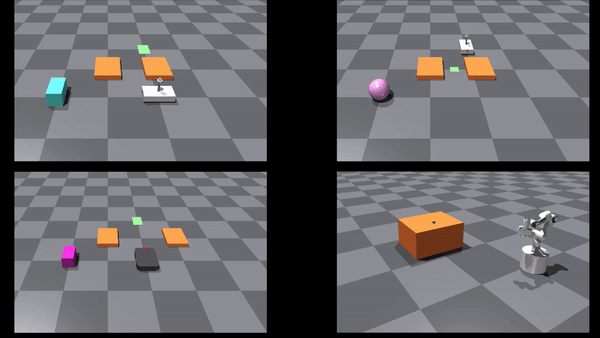

# Overview
This is an implementation of a Model Predictive Path Integral (MPPI) controller which uses IsaacGym as a dynamic model for the rollouts. We provide several examples of what tasks you can solve with it: 

<p align="center">

</p>

You can extend the repository with your robots and tasks since it is designed to be modular and reusable. 

### How to cite this work
If you found this repository useful, please consider citing the associated paper below:

- *Sampling-based Model Predictive Control Leveraging Parallelizable Physics Simulations*. Corrado Pezzato*, Chadi Salmi*, Max Spahn*, Elia Trevisan*, Javier Alonso Mora, and Carlos Hernandez Corbato. arXiv:2307.09105. Under review at IEEE Robotics and Automation Letters, 2023.

# Installation


This project requires the source code of IsaacGym inside the folder
`thirdparty`. Download it from https://developer.nvidia.com/isaac-gym, extract it, and place
it in `mppi-isaac/thirdparty`. Then you can proceed with the installation described below. 


## Dockerized
If you don't have Ubuntu 20 there is no standard support for Isaac Gym neither the version of Python this repository relies on. To solve this, you can acquire Isaac Gym in the ways stated already in this README eslewhere and proceed with instructions below:

*NOTE: To use the GPU pipeline (default) you need an NVIDIA graphics card. If you do not have one, you can use the CPU pipeline, with fewer samples.*

1. Instead of placing isaac gym inside /thirdparty, extract it to a folder on your non-Ubuntu 20 system. Then, inside the docker folder inside it, run the build.sh script to create a docker container with Isaac Gym inside. 
2. Use ./run.sh to run the container, if you'd like to use the GUI through xhost add anything after the ./run.sh e.g. ```bash ./run.sh aaaa ```, works.
3. Within the container, navigate to home ```bash cd ~ ``` or anywhere else you don't need admin priviliges, and then clone this repository.
4. Once you have done so, create a symbolic link to the version of isaacgym installed within the container already, if you cd into the thirdparty folder that command looks something like this: ```bash ln -s /opt/isaacgym ./isaacgym```.
5. Follow the other instructions in this README to install poetry, install the venv of the repo, and then run the examples.


## Virtual environment (advised)
You can install the necessary dependencies using [poetry](https://python-poetry.org/docs/) virtual environment. After installing poetry, move into `mppi-isaac` and run
```bash
poetry install --with dev
```
Bear in mind that the installation might take several minutes the first time. But it's worth it.

Access the virtual environment using
```bash
poetry shell
```

### Virtual environment - Pycharm
If you are using Pycharm (professional), first add a new Python interpreter via 'Add New Interpreter', 'Add local interpreter" and 
create a virtual environment within the mppi-isaac folder called 'venv'. Then install the necessary dependencies using [poetry](https://python-poetry.org/docs/) in the virtual environment.
```bash
poetry install --with dev
```

### **Test the installation**
Test that everything is properly set up, use pytest
```bash
cd examples
poetry run pytest
```
## System-level installation
Alternatively, you can also install at the system level using pip, even though we advise using the virtual environment:
```bash
pip install .
```

## Troubleshooting
If you have an Nvidia card and after running the simulation you get a black screen, you might need to force the use of the GPU card through ``export VK_ICD_FILENAMES=/usr/share/vulkan/icd.d/nvidia_icd.json``. Run this command from the same folder as the script to be launched for every terminal

# Running the examples
Access the virtual environment if installed with poetry (with `poetry shell`). You can run two types of examples, either the ones using IsaacGym or the ones using Pybullet. In the `examples` folder, you find all the scripts. The ones related to IsaacGym contain either "server" or "client" in the name. 

## IsaacGym examples
To run the examples with IsaacGym (for example for non-prehensile pushing and whole-body control), you need two terminals because it is required to run a "server" and a "client" script. In the first one run the server:
```bash 
python3 heijn_push_server.py
```
In the second one the client:
```bash 
python3 heijn_push_client.py
```

## Pybullet examples
Simply run one of the example scripts which use Pybullet, for instance for the panda robot:
```bash
python3 panda_robot_with_obstacles.py
```
